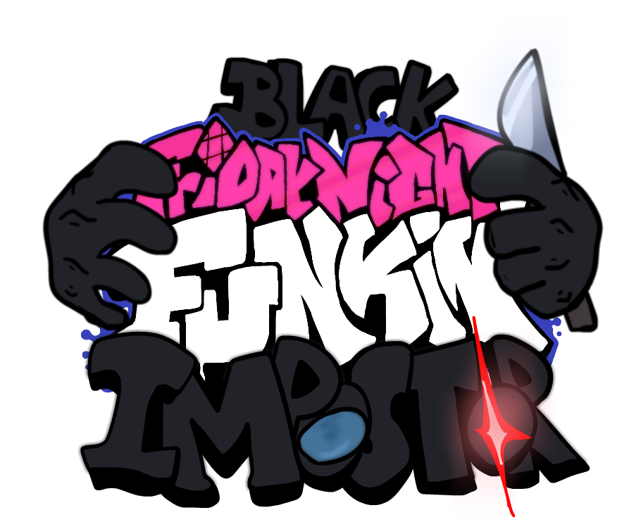

# Built with [Kade Engine 1.5.4](https://github.com/KadeDev/Kade-Engine)

# Credits

### Friday Night Funkin'
 - [ninjamuffin99](https://twitter.com/ninja_muffin99) - Programming
 - [PhantomArcade3K](https://twitter.com/phantomarcade3k) and [Evilsk8r](https://twitter.com/evilsk8r) - Art
 - [Kawai Sprite](https://twitter.com/kawaisprite) - Music

 - [Newgrounds](https://www.newgrounds.com/portal/view/770371)
 - [Itch.io](https://ninja-muffin24.itch.io/funkin)
 - [Source Code](https://github.com/ninjamuffin99/Funkin)

This game was made with love to Newgrounds and its community. Extra love to Tom Fulp.
### Kade Engine
- [KadeDeveloper](https://twitter.com/KadeDeveloper) - Maintainer and lead programmer
- [The contributors](https://github.com/KadeDev/Kade-Engine/graphs/contributors)

### Shoutout
- [Team Funktastic](https://github.com/GrowtopiaFli) - Inspiration.
- [Modding Discord Community](https://discord.gg/SuF63NBv) - Coding help.
- [BrightFyre Community Server](https://discord.gg/ptZjaPTK) - Coding help.
- [Innersloth](https://www.innersloth.com/) - Among Us Creators.
